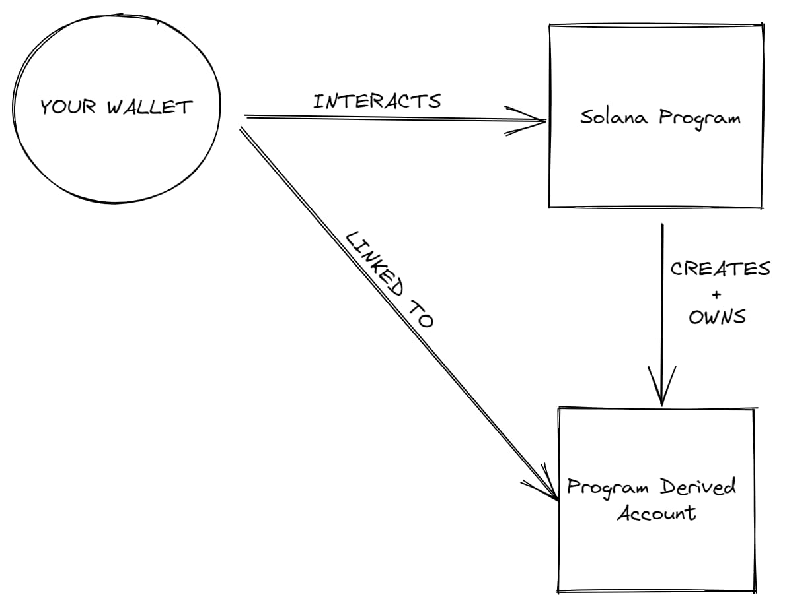
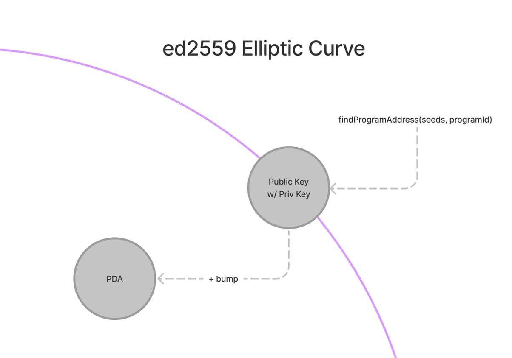

## solana

### 安装 Rust 和 Solana CLI

```shell
curl --proto '=https' --tlsv1.2 -sSf https://sh.rustup.rs | sh

sh -c "$(curl -sSfL https://release.solana.com/v1.16.14/install)"
```

查看版本

```shell
rustc -V

solana -V
```

更多内容请查看：

https://www.rust-lang.org/tools/install

https://docs.solana.com/cli/install-solana-cli-tools

### solana 常用命令

#### acount

```shell
solana-keygen new -o ./solana/id.json # 生成地址

solana address # 查看地址

solana balance # 查询余额

solana airdrop 1 # 水龙头
```

#### 配置

```shell
solana config set --url localhost # 设定 rpc 为本地环境
solana config set --url devnet # 设定 rpc 为开发环境

solana config get # 获取配置信息
```

#### 运行本地测试节点

```shell
solana-test-validator
```

#### 通过水龙头 获取测试币

```shell
solana airdrop 1 #每次不要请求太多 coin，时间不要太频繁
```

#### 转账

```shell
solana transfer <address>  1
solana transfer --allow-unfunded-recipient <address> 1
```

#### 部署合约

```shell
solana program deploy <path>

# 编译好的合约文件是个so文件，路径是 "./target/deploy/hello.so"
```

#### 查看合约日志（只能在本地网络生效）

```shell
solana logs <PROGRAM_ID>

solana logs DKtPpFnJoMn6qUFiPxWN61DJqFqPpYoGShrwaG2QJfRx
```

### 释放合约

部署合约较耗 SOL，用于合约的存储费用。
如果合约不再使用，可以用命令释放掉合约，指定接收人，支付的 SOL 就会返还。

```shell
solana program close
```

```shell
solana program close  --buffers

Buffer Address                               | Authority                                    | Balance
ER5KN9u6uy9N8d2TPFLwUhuBXwmbz5TDYZuR9tiXctTu | HxJHFKt8nFxmXL8HVnD84YJFrsZmHC1ux9fgwm2awkS8 | 3.42752856 SOL
HczChndCYcydwemUsNqePGZzE139NnoVbnWZ6d8PQudE | HxJHFKt8nFxmXL8HVnD84YJFrsZmHC1ux9fgwm2awkS8 | 0.2798268 SOL
9PWdoUoZ2q76x7dZCWUqoabnpmGdEAh5xp5ub1bV9Pz5 | HxJHFKt8nFxmXL8HVnD84YJFrsZmHC1ux9fgwm2awkS8 | 0.2798268 SOL
8q9B696b3ZWVNTuikNsrwBfXRnew3hcqoKiBGzeD4uz9 | HxJHFKt8nFxmXL8HVnD84YJFrsZmHC1ux9fgwm2awkS8 | 0.2798268 SOL
```

## 地址基本概念

### PDA 地址

PDA = Program Derived Addresses 程序派生地址

PDA 是一种特殊类型的账户，但是它们不是真正的账户。它们只是一种特殊的地址，由程序控制，而不是私钥。这意味着它们不是真正的账户，因为它们没有私钥，因此无法对其进行签名。



普通的 Solana 账户是使用 Ed25519 签名系统创建的，而 PDA 由程序控制，因此它们不需要私钥。因此，我们使用不在 Ed25519 曲线上的地址来制作 PDA。



它提供了链上和链下程序确定性地定位数据的方法。可以将其视为一个键值存储，其中 seeds、programId 和 bump 结合形成密钥，以及网络在该地址上存储的值。

**每个账户有 10 Mb 的限制。**

```js
// 用于全局状态的示例
const [pda, bump] = await PublicKey.findProgramAddress(
  [Buffer.from("GLOBAL_STATE")],
  programId
);

// 为每个用户存储单独计数器的示例
const [pda, bump] = await PublicKey.findProgramAddress(
  [publickey.toBuffer()],
  programId
);

// 创建链上笔记系统，每个用户都可以存储自己的笔记的示例
const [pda, bump] = await PublicKey.findProgramAddress(
  [publickey.toBuffer(), Buffer.from("First Note")],
  programId
);
```

## 工具

https://sol-tools.tonyboyle.io/nft-tools

https://github.com/cryptoloutre/solana-tools

## 钱包

- Phantom https://phantom.app/
- Glow https://glow.app/
- BackPack https://www.backpack.app/ 需要登录

## SPL
https://spl-token-faucet.com/

## NFT

https://www.metaplex.com/ 类似 erc721

## NFT explorer

https://app.step.finance/

https://solana.nftscan.com/ 只支持主网

https://magiceden.io/ 支持 solana、eth、polygon

---

参考：

https://docs.solana.com/api/http

https://www.datawallet.com/crypto/how-to-get-solana-faucet-tokens
